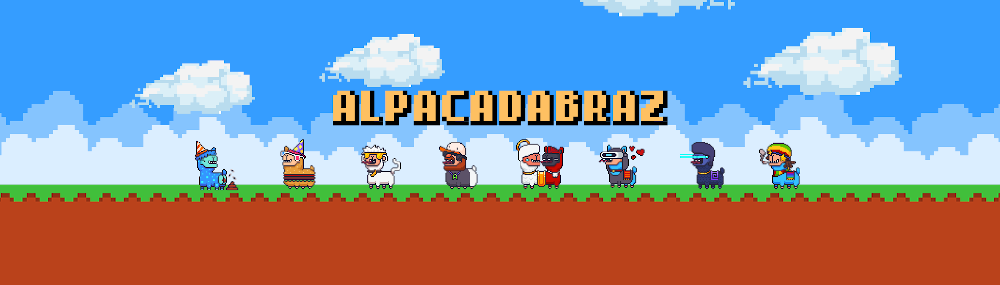

<h1 align="center">Hi 👋, I'm LD</h1>
<h3 align="center">I do python coding and blockchain stuffs the most!</h3>
<h3 align="center">Make sure you check out repos below <3</h3>

- 💼 Microsoft Taiwan | **Intern at Microsoft Technology Center (MTC)**

- 🦙 Ex - ALPACADABRAZ TEAM | **MODERATOR & TECH SUPPORT**

- 🕹️ PlayfunI Network | **OWNER**

- 💬 Contact me via Discord **樂弟#7582**

- 🌱 Remember **You Only Live Once!**

 
 

<h3 align="left">Connect with me:</h3>

<h3 align="left">Languages and Tools:</h3>

                     

